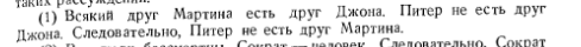
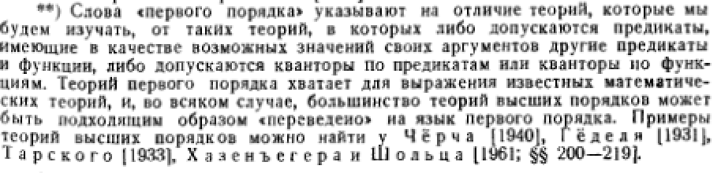
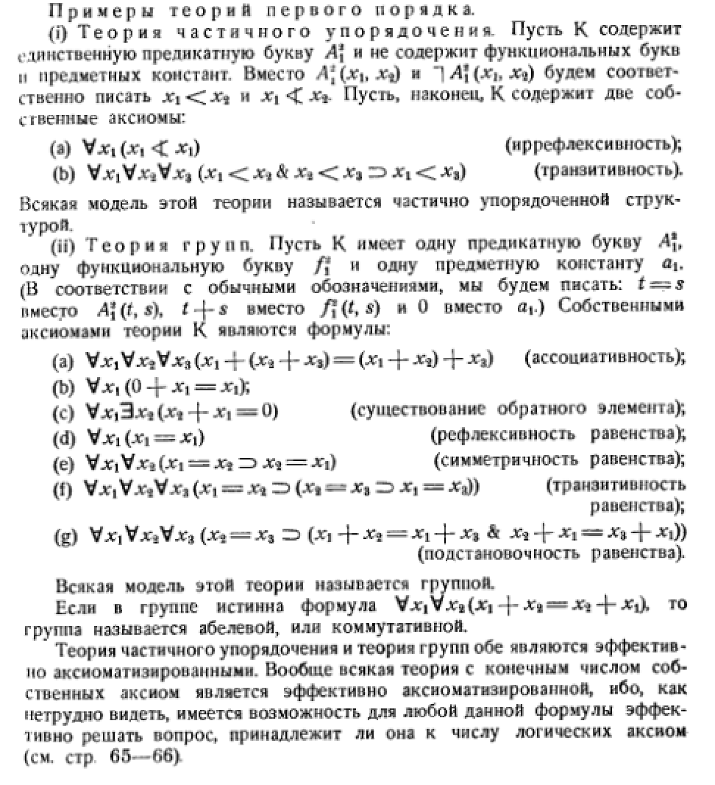
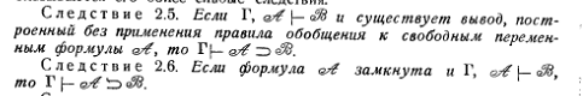
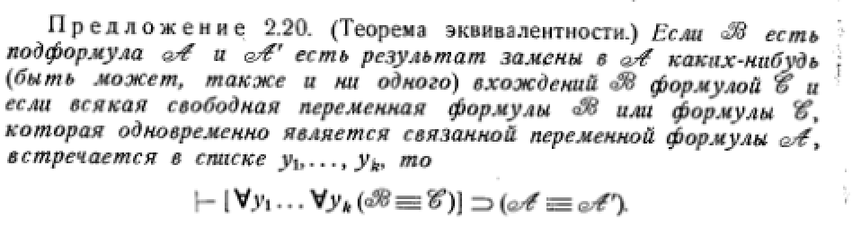

## 17) Системы аксиом для исчисления высказываний. Формальная аксиоматическая теория. Теорема дедукции.

1. A→(B→A);
2. (A→(B→C))→((A→B)→(A→C));
3. (A∧B)→A;
4. (A∧B)→B;
5. A→(B→(A∧B));
6. A→(A∨B);
7. B→(A∨B);

8. (A→C)→((B→C)→(A∨B→C));

9. ¬A→(A→B);

10. (A→B)→((A→¬B)→¬A);

11. A ∨ ¬A.

**Форма́льная аксиоматическая теория** — 

> результат строгой [формализации](https://ru.wikipedia.org/wiki/%D0%A4%D0%BE%D1%80%D0%BC%D0%B0%D0%BB%D0%B8%D0%B7%D0%B0%D1%86%D0%B8%D1%8F) [теории](https://ru.wikipedia.org/wiki/%D0%A2%D0%B5%D0%BE%D1%80%D0%B8%D1%8F), предполагающей полную абстракцию от смысла слов используемого языка, причем все условия, регулирующие употребление этих слов в теории, явно высказаны посредством [аксиом](https://ru.wikipedia.org/wiki/%D0%90%D0%BA%D1%81%D0%B8%D0%BE%D0%BC%D0%B0) и правил, позволяющих вывести одну фразу из других.

Формальная теория считается определенной, если:

1. Задано конечное или [счётное множество](https://ru.wikipedia.org/wiki/%D0%A1%D1%87%D1%91%D1%82%D0%BD%D0%BE%D0%B5_%D0%BC%D0%BD%D0%BE%D0%B6%D0%B5%D1%81%D1%82%D0%B2%D0%BE) произвольных символов. Конечные последовательности символов называются *выражениями* теории.
2. Имеется подмножество выражений, называемых *формулами*.
3. Выделено подмножество формул, называемых *аксиомами*.
4. Имеется конечное множество отношений между формулами, называемых *правилами вывода*.

**Теорема о дедукции**

> Γ ⊢ A → B тогда и только тогда, когда Γ ∪ {A} ⊢ B.

В одну сторону утверждение почти очевидно: пусть Γ ⊢ (A → B).Тогда и Γ,A ⊢ (A → B). (Для краткости мы опускаем фигурныескобки и заменяем знак объединения запятой.) Согласно определе-нию, Γ,A ⊢ A, откуда по MP получаем Γ,A ⊢ B.

Пусть теперь Γ, A ⊢ B. Нам надо построить вывод формулы A →B из Γ. Возьмём вывод C1,C2,...,Cn формулы B = Cn из Γ,A.Припишем ко всем формулам этого вывода слева посылку A:

(A → C1),(A → C2),...,(A → Cn).

[п. 1] Исчисление высказываний (ИВ) 43

Эта последовательность оканчивается на (A → B). Сама по себеона не будет выводом из Γ, но из неё можно получить такой вы-вод, добавив недостающие формулы, и тем самым доказать лемму одедукции.

Будем добавлять эти формулы, двигаясь слева направо. Пустьмы подошли к формуле (A → Ci). По предположению формула Ciлибо совпадает с A, либо принадлежит Γ, либо является аксиомой,либо получается из двух предыдущих по правилу MP. Рассмотримвсе эти случаи по очереди.

(1) Если Ci есть A, то очередная формула имеет вид (A → A). Полемме 1 она выводима, так что перед ней мы добавляем её вывод.

(2) Пусть Ci принадлежит Γ. Тогда мы вставляем формулы Ci иCi → (A → Ci) (аксиома 1). Применение правила MP к этим форму-лам даёт (A → Ci), что и требовалось.

(3) Те же формулы можно добавить, если Ci является аксиомойисчисления высказываний.

(4) Пусть, наконец, формула Ci получается из двух предыдущихформул по правилу MP. Это значит, что в исходном выводе ей пред-шествовали формулы Cj и (Cj → Ci). Тогда в новой последователь-ности (с добавленной посылкой A) уже были формулы (A → Cj)и (A → (Cj → Ci)). Поэтому мы можем продолжить наш Γ-вывод,написав формулы

((A→(Cj →Ci))→((A→Cj)→(A→Ci))(аксиома2);
((A → Cj) → (A → Ci)) (modus ponens);
(A → Ci) (modus ponens).

## 18)  Теорема о полноте теории L. Непротиворечивая и абсолютно непротиворечивая теория.

L - формальная аксиоматическая теория.

**Теорема (о полноте):** 

> Формула А исчисления высказываний L является тавтологией тогда и только тогда, когда она является теоремой исчисления L

**Доказательство:** Если формула А является теоремой исчисления L, то, поскольку аксиомы являются тавтологиями и применение MP к тавтологиям Р и РQ даёт тавтологию, мы можем заключить, что А – тавтология. Это доказывает, что каждая теорема является тавтологией. Для доказательства обратного утверждения нам понадобится следующая лемма.

**Следствие (теорема о непротиворечивости).** 

> *Исчисление высказываний L непротиворечиво в том смысле, что не существует формулы А исчисления L, для которых А и А были бы теоремами.*

**Доказательство.** По теореме о полноте, каждая теорема исчисления является тавтологией. Но отрицание тавтологии не является тавтологией, значит, ни для какой формулы А невозможно, чтобы А и А были теоремами.

**Абсолютно непротиворечивая теория - **теория, в которой не все формулы являются теоремами.

## 19) Кванторы. Примеры их использований в логических рассуждениях. Свободные исвязанные переменные.

1. Квантор всеобщности
2. Квантор существования

Вхождение переменной в формулу называется **связанным**, если оно находится в области действия квантора, использующего эту переменную, или же оно является вхождением в этот квантор. Вхождение переменной в формулу называется **свободным**, если оно не является связанным.

### 20)  Интерпретации, выполнимость и истинность, модели. Их свойства.

Если в формулу логики предикатов вместо каждой предикатной переменной подставить конкретный предикат, определенный на некотором выбранном множестве *M*, то формула превратится в конкретный предикат, заданный над множеством *М*. Такая подстановка называется **интерпретацией**.

**Пример:** дадим интерпретацию формуле (∀*x*)(∃*y*)(P(*x,y*)) *M* -  множество всех мужчин (x, y belongs to M). P() - x is a father of y. То есть, у каждого мужчины есть сын - тождественно ложная формула

Если в функции присутствуют свободные переменные, она выражает какое-то отношение. Отношение может быть **выполнено** (истинно) на области выполнимости, а может быть **не выполненно** (ложно). **Истинность** определяет тоже самое для замкнутых функций (не имеющий подставляемых переменных).

Интерпретация называется **моделью** для данного множества формул Г, если каждая формула из Г истинна в данной интерпретации.

Свойства

1. А ложно в интерпретации когда -А истинно
2. Никакая формула не может быть истинной и ложной в одной интерпретации
3. А, А-B истинно, B истинно
4. A->B ложно когда 1->0
5. табл истинности для ==
6. замыкание формулы - формула полученная приписыванием к предыдущей кванторов всеобщности для всех свободных переменных, входящих в формулу.
7. Тавтологии истинны во всех интерпретациях
8. … стр 61 Мендельсон

## 21)  Теории первого порядка. Примеры. Предложения о тавтологии и о непротиворечивости теории K.

**Примеры:**

**Предложение о ==тавтологии==:**

> Если формулма А теории К есть частный случай тавтологии в К, то А теорема в К и может быть выведена с помощью аксиом (1-3) и MP.

**Предложение о ==непротиворечивости==:**

> Всякое исчисление предикатов первого порядка К *непротиворечиво*

Доказательства стр. 68

## 22) Теорема о дедукции в теории первого порядка и ее следствия

> Если G, *A* ├ *B*, причем существует такой вывод формулы *B* из множества формул G È {*A*}, в котором ни при каком применении правила Gen к формулам, зависящем в этом выводе от формулы *A*, не связывается квантором никакая свободная переменная формулы *A*, то G ├ A ->B. 

## 23)  Лемма о расширении непротиворечивой теории первого порядка K. Теорема о полноте исчисления предикатов первого порядка.

> Если теория К первого порядка непротиворечива, то существует непротиворечивое полное ее ==расширение==

Теорема Геделя о полноте

> Во всяком исчислении первого порядка теоремами являются все те и только те формулы, которые являются ==общезначимыми==

## 24) Правило индивидуализации. Правило существования. Теорема эквивалентностив теории первого порядка K.

**Терм** — 

> выражение [формального языка](https://ru.wikipedia.org/wiki/%D0%A4%D0%BE%D1%80%D0%BC%D0%B0%D0%BB%D1%8C%D0%BD%D1%8B%D0%B9_%D1%8F%D0%B7%D1%8B%D0%BA) ([системы](https://ru.wikipedia.org/wiki/%D0%A4%D0%BE%D1%80%D0%BC%D0%B0%D0%BB%D1%8C%D0%BD%D0%B0%D1%8F_%D1%81%D0%B8%D1%81%D1%82%D0%B5%D0%BC%D0%B0)) специального вида. Понятие **терма** определяется индуктивно:
>
> 1. всякая индивидная константа есть терм;
> 2. всякая свободная [переменная](https://ru.wikipedia.org/wiki/%D0%9F%D0%B5%D1%80%D0%B5%D0%BC%D0%B5%D0%BD%D0%BD%D0%B0%D1%8F_%D0%B2%D0%B5%D0%BB%D0%B8%D1%87%D0%B8%D0%BD%D0%B0) есть терм;
> 3. если t~1~, …, t~n~ — термы, то f^i^ (t~1~, …, t~n~) также есть терм.

Правило ==индивидуализации==

> Если терм t свободен для *x* в *A(x)*, то ∀*xA(x)* $\vdash$ *A(t)*.

Правило ==существования==:

> Если терм t свободен для *x* в *A(x)*, то $ \vdash A(t) \supset \exists x A(x) \Rightarrow A(x) \vdash \exists x A(x)$

Теорема ==эквивалентности== 

док-во стр.82

==Правило С==

стр. 83